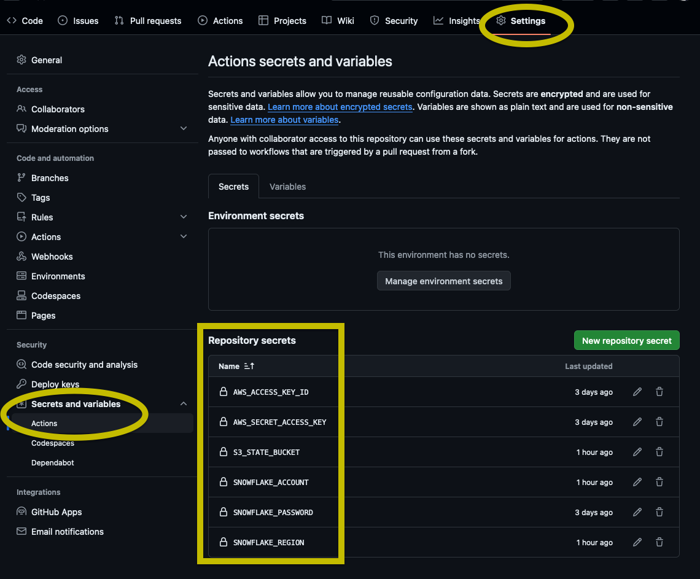
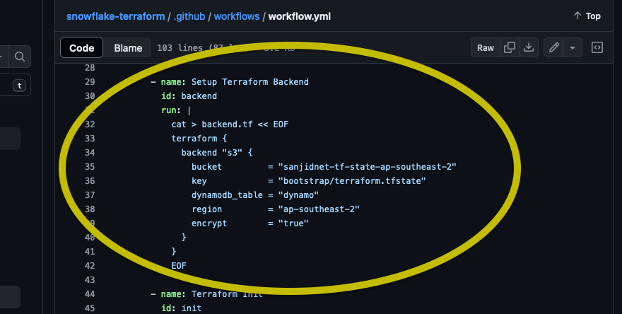

## Silicon Valley Quick-Start

Instantiating the above module will create a set of resources mostly aligned
with those outined in [this great Fishtown Analytics blog post](https://blog.getdbt.com/how-we-configure-snowflake/).


Below is a summary of the resources created:

1. Two "employee users", each with their own isolated development databases and access to _only_ read-only assets in the _ANALYTICS_ database.

2. Three "raw" storage application databases - STITCH, FIVETRAN, and MELTANO - with system users that have administrative access.

3. Two databases accessible only by the `DBT_CLOUD` role: `ANALYTICS_STAGING` and `ANALYTICS_PROD`.

4. A couple of general roles:
- `ANALYST` should be able to read _only_ from the production `ANALYTICS_PROD` database.
- The `READER` role with read-only access to all databases.
- `SYSADMIN` should have admin access to all the created database resources.
- `DBT_CLOUD` should have admin access to the dev and staging analytics databases, and read-only access to other databases.

## Get started 

### Testing

1. In your Snowflake account, create a terraform user with the right roles

```{sql}
// set up user and role
create user terraform_user;
create role terraform;
grant role terraform to user terraform_user;

// grant account privileges
grant create user on account to role terraform;
grant create database on account to role terraform;
grant create integration on account to role terraform;
grant create role on account to role terraform;
grant create warehouse on account to role terraform;
grant manage grants on account to role terraform;

// Note that, currently, `CREATE RESOURCE MONITOR` cannot be granted to another user
```

2. Give it an easy password... you will be using the terminal, remember?

3. Try out the module in the root directory managing the state file locally (or remotely if that's preferred)

### Production

1. Create an AWS account and generate access key and secret for a user who will manage terraform state in S3

2. `..` to `bootstrap` directory and populate the `terraform.tfvars` file

3. Do the terraform thing there. That will create the backend resources needed to store the prod state file 

4. In a separate Snowflake (intended to be the prod account) create `terraform_user` just like above

5. Take all of your credentials and save them as GitHub Secrets



6. Update the backend in the ci file too or send a pull request to parameterize this too



7. Do your terraform thing. CI implemented for 

- pull request to main: shows terraform plan
- push to main: applies the plan

##  Additional resources

Some great content from dbt Labs, whether you use Terraform or not.

- dbt Blog: [How we configure Snowflake](https://blog.getdbt.com/how-we-configure-snowflake/)
- dbt Discourse: [Setting up Snowflake - the exact grant statements we run](https://discourse.getdbt.com/t/setting-up-snowflake-the-exact-grant-statements-we-run/439)
- dbt Blog: [Five principles that will keep your data warehouse organized](https://blog.getdbt.com/five-principles-that-will-keep-your-data-warehouse-organized/)
- Snowflake's [Quickstart with Terraform](https://quickstarts.snowflake.com/guide/terraforming_snowflake) 
- Snowflake's tutorial [on YouTube](https://www.youtube.com/watch?v=chqyASQ_Rrg) and [the GitHub repo](https://github.com/sfc-gh-sekim/cicd-snowflake-with-terraform-demo)

